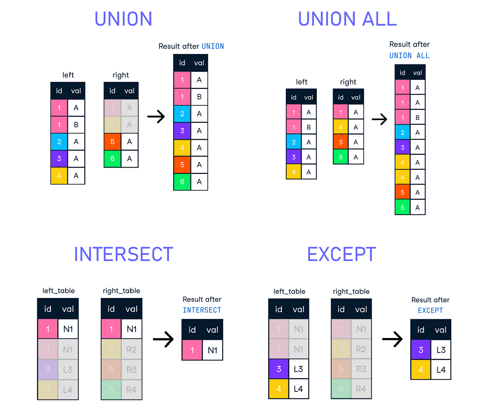

[`Introducción a Bases de Datos`](../../README.md) > [`Sesión 04`](../README.md)

### 4.3. `UNION` e `INTERSECT`

*Recordemos del prework que...*

👉 La cláusula `UNION` se utiliza para combinar el resultado de dos o más consultas SQL en un único conjunto de resultados. Básicamente, elimina duplicados y combina los registros de los resultados de las consultas en un solo conjunto de resultados. Es importante destacar que las consultas deben tener la misma cantidad de columnas y los tipos de datos deben ser compatibles.

👉 La cláusula `INTERSECT` se utiliza para combinar los resultados de dos consultas SQL y devolver solo los registros que aparecen en ambos conjuntos de resultados. En otras palabras, `INTERSECT` devuelve las filas que son comunes en ambas consultas. Al igual que con `UNION`, las consultas deben tener la misma cantidad de columnas y los tipos de datos deben ser compatibles.

👉 Lamentablemente **MySQL** no soporta `INTERSECT`, una forma de simularlo es con subconsultas. Sin embargo, te mencionamos su comportamiento porque es usual que lo uses en el día a día con otros gestores de bases de datos.

👉 Además de estos operadores existen otras variantes, sin embargo, en esta sesión no profundizaremos en éstas. 

#### 🧐 Actividades

- [`Ejemplo 3`](ejemplo03/README.md)
- [`Reto 3`](reto03/README.md)

 

[`Anterior`](../tema02/reto02/README.md) | [`Siguiente`](ejemplo03/README.md)
