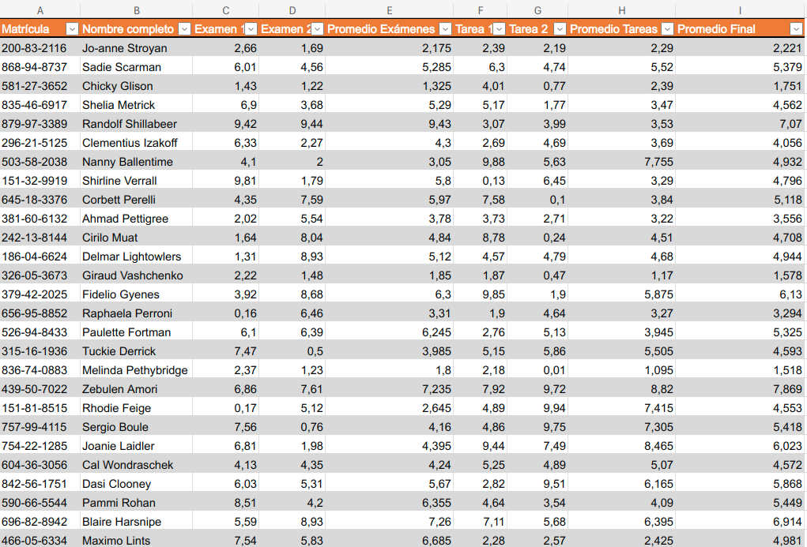

[`Introducción a Bases de Datos`](../../README.md) > [`Sesión 05`](../README.md)

### :brain: Nuestro primer círculo de estudio

Te damos la bienvenida a nuestro primer círculo de estudio. En este círculo de estudio:

- Resolveremos todas las dudas que tengas en este momento sobre alguno de los temas que hemos abordado:

   :star: Introducción a SQL   
   :star: Agrupamientos   
   :star: Subconsultas   
   :star: Cruces   
   :star: Diseño básico de bases relaciones

- Para aesgurarnos de que domines los temas anteriores resolveremos paso a paso un miniproyecto. Aunque en la actividad te iremos guiando paso a paso sobre lo que tienes que hacer, será importante que lo consideres como un reto y que preguntes todas las dudas que tengas.

- También exploraremos uno que otro tema extra para completar tu formación del módulo. :heart:

#### Diseño de una base de datos para calificaciones

**Problema**: El profesor de una universidad tiene las calificaciones de las personas inscritas en su curso y quiere pasar los datos a una base de datos **MySQL** para poderlo manipular de forma sencilla por medio de **SQL**.

El archivo se encuentra en una hoja de cálculo con la siguiente estructura:

 

Puedes descargar la hoja de cálculo aquí: [Calificaciones.xlsx](../archivos/Calificaciones.xlsx)

Los retos que deberás cumplir para completar este proyecto son:

1. [**`Reto 01`**](reto01/README.md): Diseñar la base de datos siguiendo un enfoque relacionar. Esto lo puedes hacer aplicando las formas normales. Puedes añadir columnas a la hoja de cálculo si lo consideras necesario.

2. [**`Reto 02`**](reto02/README.md): Crear las tablas necesarias para cargar la información. Esto lo puedes hacer usando el comando `CREATE TABLE`. También necesitarás crear el esquema de la base de datos. Esto no lo vimos en el contenido de la sesión con el fin de que pongas en práctica tus habilidades de investigación... Necesitarás investigar un poco para responder a la pregunta *¿Cómo se crea un esquema de base de datos en MySQL*. **Importante**: Para no sobreescribir los cambios de otras personas, coloca como nombre de tu esquema tu nombre.

3. [**`Reto 03`**](reto03/README.md): Cargar los datos del archivo en las tablas que creaste. Esto lo puedes hacer con `INSERT INTO` (aunque son 50 registros, no creemos que seas tan paciente...), con el comando `LOAD DATA INFILE` o bien usando el asistente de Workbench (te recordamos la liga del tutorial: [aquí](https://dev.mysql.com/doc/workbench/en/wb-admin-export-import-table.html)).

4. [**`Reto 04`**](reto04/README.md): Reconstruir el formato de las calificaciones, para ello, tendrás que realizar las siguientes tareas (aunque esto dependerá del diseño que propusiste):

   - Cruzar los datos para relacionar las calificaciones de las personas inscritas.

   **Ejercicios que probablemente requieren de investigación**

   - Modificar las consultas la información se despligue de manera horizontal. Te sugerimos usar `CASE` como auxiliar.
   - Usar agrupamientos para obtener los promedios de cada rubro y promedios finales.
   - Crear una vista con el formato de la tabla final para no almacenar los datos y que se alojen en una *tabla virtual*.

Te daremos **120 MINUTOS** para que intentes resolver estos ejercicios. Puedes seguir el material del repositorio para resolverlo, pero si realmente quieres medir cuanto has aprendido, te sugerimos intentarlo antes de ver las respuestas.

[`Anterior`](../tema04/ejemplo04/README.md) | [`Siguiente`](reto01/README.md)
