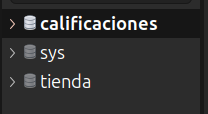

[`Introducción a Bases de Datos`](../../../README.md) > [`Sesión 05`](../../README.md) > [`Círculo de estudio`](../README.md)

#### Reto 3

##### Objetivos 🎯

- Poner en práctica la creación de tablas en **SQL**.

##### Requisitos 📋

- MySQL Workbench instalado.

##### Desarrollo 🚀

Vayamos a la primera parte de la solución: 

*Cargar los datos del archivo en las tablas que creaste. Esto lo puedes hacer con `INSERT INTO` (aunque son 50 registros, no creemos que seas tan paciente...), con el comando `LOAD DATA INFILE` o bien usando el asistente de Workbench (te recordamos la liga del tutorial: [aquí](https://dev.mysql.com/doc/workbench/en/wb-admin-export-import-table.html)).*

Te sugerimos seguir los siguientes pasos para llegar a la solución. Sin embargo, puedes resolverlo de la forma que creas más conveniente:

---
> **Paso 1.** Cargar los datos.
>
> 

Solución

>
> Para cargar los datos usaremos el Wizard. Sigue los siguientes pasos:
>
> 1. Guardar cada hoja como un archivo CSV. Para ello vamos a `Archivo` > `Exportar` y seleccionamos *Descargar esta hoja como CSV*. Si no te sale esa opción esto dependerá de la versión del software para manejar hojas de cálculo. Pregunta a **ChatGPT** o a tu experata o experto.
>
>   Te dejamos los archivos por cualquier cosa:
>
>    - [Alumnos.csv](../../archivos/Alumnos.csv)
>    - [Tareas.csv](../../archivos/Tareas.csv)
>    - [Examenes.csv](../../archivos/Examenes.csv)
>
> 2. Te mostraremos cómo cargar el archivo `Alumnos.csv` y te dejaremos a ti cargar los otros. En el listado de bases de datos que muestra Workbench
>
>    
> 
>   da clic derecho en el nombre de tu base y selecciona `Table Data Import Wizard`
> 

---

[`Anterior`](../reto02/README.md) | [`Siguiente`](../reto03/README.md)
