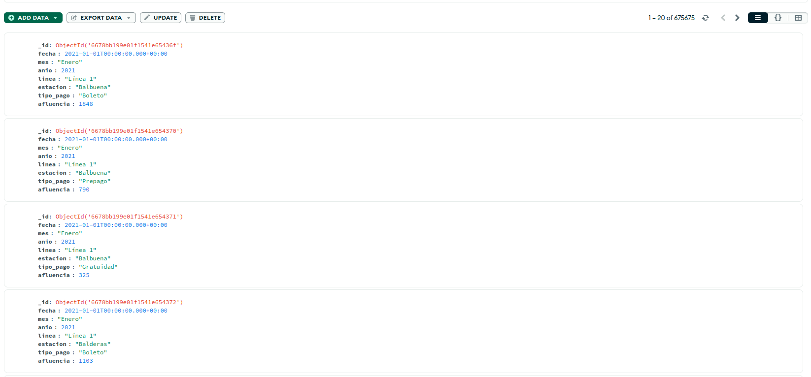
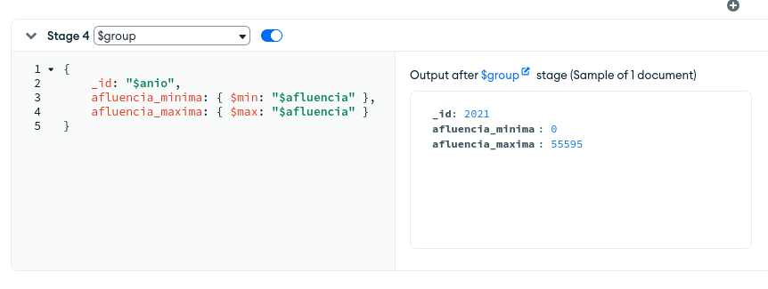

[`Introducción a Bases de Datos`](../../README.md) > [`Sesión 08`](../README.md)

### 8.2 Caso de estudio: Afluencia Diaria de Pasajeros del Metro de la Ciudad de México 

#### Descripción del Proyecto

Este Mini Proyecto tiene como objetivo realizar un análisis exploratorio y predictivo de los datos de afluencia diaria del metro de la Ciudad de México. Utilizando datos almacenados en un archivo CSV, cargaremos estos datos en una base de datos MongoDB, realizaremos una conexión con Google Sheets para el análisis y generación de reportes, y finalmente desarrollaremos un modelo de predicción de la demanda de afluencia.

Los datos incluyen los siguientes campos:

- `fecha`: Fecha del registro de afluencia.
- `mes`: Mes del registro.
- `anio`: Año del registro.
- `linea`: Línea del metro donde se registro la afluencia.
- `estacion`: Estación del metro donde se registró la afluencia.
- `tipo_pago`: Tipo de pago utilizado (boleto, tarjeta, etc.).
- `afluencia`: Número de personas que utilizaron el metro.

#### Objetivos del Proyecto

1. Importar y almacenar datos en MongoDB
2. Conectar MongoDB con Python
3. Realizar un análisis exploratorio de los datos en MongoDB
5. Generar y compartir un reporte final en Python

#### Paso a Paso: Implementación del Proyecto

**Paso 1: Carga de Datos en MongoDB**

Crea una base de datos e importa el archivo CSV (lo puedes encontrar [aquí](https://datos.cdmx.gob.mx/dataset/afluencia-diaria-del-metro-cdmx)) a tu cluster de MongoDB. Probablemente necesites borrar las bases de datos de muestra que configuramos para las sesiones pasadas.

*PD: Usamos MongoDB pues ya usamos MySQL en otro Mini Proyecto, pero también lo podemos resolver usando un enfoque relacional.*

**Paso 2: Análisis Exploratorio en MongoDB con Agregaciones**

A continuación de presentamos algunos ejemplos de análisis exploratorio.

1. Conéctate a la base de datos que configuraste, abre la colección de afluencia del metro y ubicate en la sección de agregaciones.

	

2. Realiza un agrupamiento para calcular la afluencia promedio por línea:

	

3. Calcula la afluencia total por estación:

	

4. Calcula la afluencia mínima y máxima por año:

	

5. Cuenta el número de registros por tipo de pago:

	

6. Calcular la desviación estándar de la afluencia por estación:

	

**Paso 3: Conectar con Python**

Aquí te dejamos un [Notebook](../archivos/AnálisisSencilloMetro.ipynb) que puedes tomar como base para conectar tu base con Python y explorar el tipo de cosas que podrás hacer en el resto de módulos del programa.

**Paso 4: Interpretación de Resultados**

A manera de reto, responde las siguientes preguntas con base en el notebook generado:

1. ¿Por qué crees que el valor con mayor afluencia es 0? En el contexto de la CDMX ¿qué significa esto?

2. ¿Cuál es la línea con mayor afluencia? ¿Por qué crees que la L12 sea la que tienen la menor afluencia?

3. ¿Cuál es la estación con mayor afluencia?

#### Importancia de este tipo de proyectos

Este tipo de proyectos es crucial en el mundo de las bases de datos y la ciencia de datos por varias razones:

1. **Toma de decisiones informada:**
	- Facilita la toma de decisiones basadas en datos, mejorando la planificación y operación de servicios como el metro.

2. **Optimización de recursos:**
	- Permite la optimización de recursos al prever la demanda, lo que puede llevar a una mejor asignación de personal y material.

3. **Identificación de patrones y tendencias:**
	- Ayuda a identificar patrones y tendencias en el uso del metro, lo que puede ser útil para mejoras en infraestructura y servicios.

4. **Mejora de la experiencia del usuario:**
	- Al entender mejor cómo y cuándo las personas usan el metro, se pueden hacer ajustes para mejorar la experiencia del usuario.

5. **Innovación y desarrollo:**
	- Fomenta la innovación y el desarrollo de nuevas tecnologías y métodos para el análisis y predicción de datos.

[`Anterior`](../tema01/reto01/README.md) | [`Siguiente`](../tema03/README.md)
